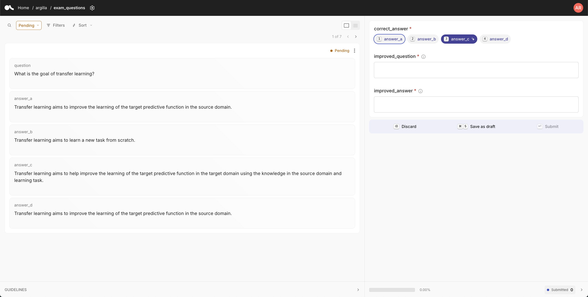
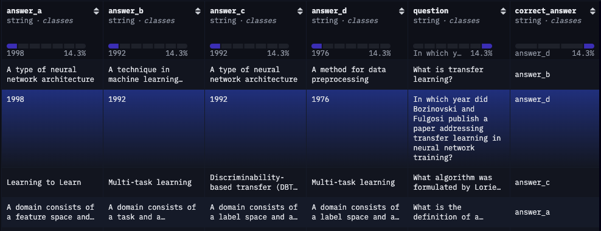

# Domain Specific Evaluation with Argilla, Distilabel, and LightEval

Most popular benchmarks look at very general capabilities (reasoning, math, code), but have you ever needed to study more specific capabilities? 

What should you do if you need to evaluate a model on a **custom domain** relevant to your use-cases? (For example, financial, legal, medical use cases)  

This tutorial shows you the full pipeline you can follow, from creating relevant data and annotating your samples to evaluating your model on them, with the easy to use [Argilla](https://github.com/argilla-io/argilla), [distilabel](https://github.com/argilla-io/distilabel), and [lighteval](https://github.com/huggingface/lighteval). For our example, we'll focus on generating exam questions from multiple documents. 

## Project Structure

For our process, we will follow 4 steps, with a script for each: generating a dataset, annotating it, extracting relevant samples for evaluation from it, and actually evaluating models.

| Script Name | Description |
|-------------|-------------|
| generate_dataset.py | Generates exam questions from multiple text documents using a specified language model. |
| annotate_dataset.py | Creates an Argilla dataset for manual annotation of the generated exam questions. |
| create_dataset.py | Processes annotated data from Argilla and creates a Hugging Face dataset. |
| evaluation_task.py | Defines a custom LightEval task for evaluating language models on the exam questions dataset. |

## Steps

### 1. Generate Dataset

The `generate_dataset.py` script uses the distilabel library to generate exam questions based on multiple text documents. It uses the specified model (default: Meta-Llama-3.1-8B-Instruct) to create questions, correct answers, and incrorect answers (known as distractors). You should add you own data samples and you might wish to use a different model.

To run the generation:

```sh
python generate_dataset.py --input_dir path/to/your/documents --model_id your_model_id --output_path output_directory
```

This will create a [Distiset](https://distilabel.argilla.io/dev/sections/how_to_guides/advanced/distiset/) containing the generated exam questions for all documents in the input directory. 

### 2. Annotate Dataset

The `annotate_dataset.py` script takes the generated questions and creates an Argilla dataset for annotation. It sets up the dataset structure and populates it with the generated questions and answers, randomizing the order of answers to avoid bias. Once in Argilla, you or a domain expert can validate the dataset with the correct answers.

You will see suggested correct answers from the LLM in random order and you can approve the correct answer or select a different one. The duration of this process will depend on the scale of your evaluation dataset, the complexity of your domain data, and the quality of your LLM. For example, we were able to create 150 samples within 1 hour on the domain of transfer learning, using Llama-3.1-70B-Instruct, mostly by approving the correct answer and discarding the incorrect ones.

To run the annotation process:

```sh
python annotate_dataset.py --dataset_path path/to/distiset --output_dataset_name argilla_dataset_name
```

This will create an Argilla dataset that can be used for manual review and annotation.



If you're not using Argilla, deploy it locally or on spaces following this [quickstart guide](https://docs.argilla.io/latest/getting_started/quickstart/).

### 3. Create Dataset

The `create_dataset.py` script processes the annotated data from Argilla and creates a Hugging Face dataset. It handles both suggested and manually annotated answers. The script will create a dataset with the question, possible answers, and the column name for the correct answer. To create the final dataset:

```sh
huggingface_hub login
python create_dataset.py --dataset_path argilla_dataset_name --dataset_repo_id your_hf_repo_id
```

This will push the dataset to the Hugging Face Hub under the specified repository. You can view the sample dataset on the hub [here](https://huggingface.co/datasets/burtenshaw/exam_questions/viewer/default/train), and a preview of the dataset looks like this:



### 4. Evaluation Task

The `evaluation_task.py` script defines a custom LightEval task for evaluating language models on the exam questions dataset. It includes a prompt function, a custom accuracy metric, and the task configuration. 

To evaluate a model using lighteval with the custom exam questions task:

```sh
lighteval accelerate \
    --model_args "pretrained=HuggingFaceH4/zephyr-7b-beta" \
    --tasks "community|exam_questions|0|0" \
    --custom_tasks domain-eval/evaluation_task.py \
    --output_dir "./evals"
```

You can find detailed guides in lighteval wiki about each of these steps: 

- [Creating a Custom Task](https://github.com/huggingface/lighteval/wiki/Adding-a-Custom-Task)
- [Creating a Custom Metric](https://github.com/huggingface/lighteval/wiki/Adding-a-New-Metric)
- [Using existing metrics](https://github.com/huggingface/lighteval/wiki/Metric-List)

## Requirements

This tutorial requires dependencies which you can install using the following command:

```sh
pip install -r requirements.txt
```

## Contributing

Feel free to contribute to this project by submitting issues or pull requests. For major changes, please open an issue first to discuss what you would like to change.

## License

[MIT License](https://opensource.org/licenses/MIT)
