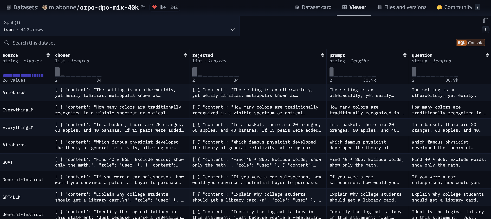
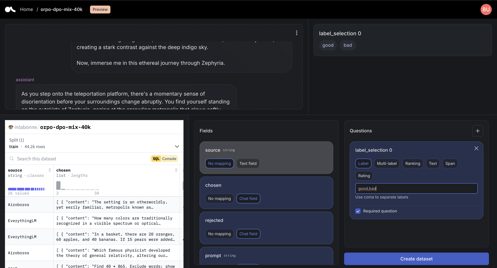
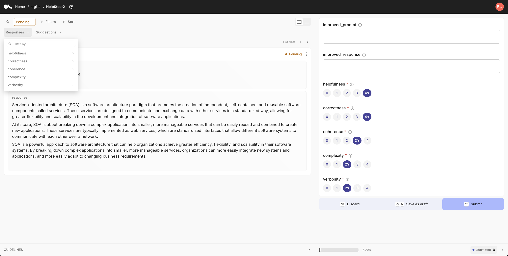
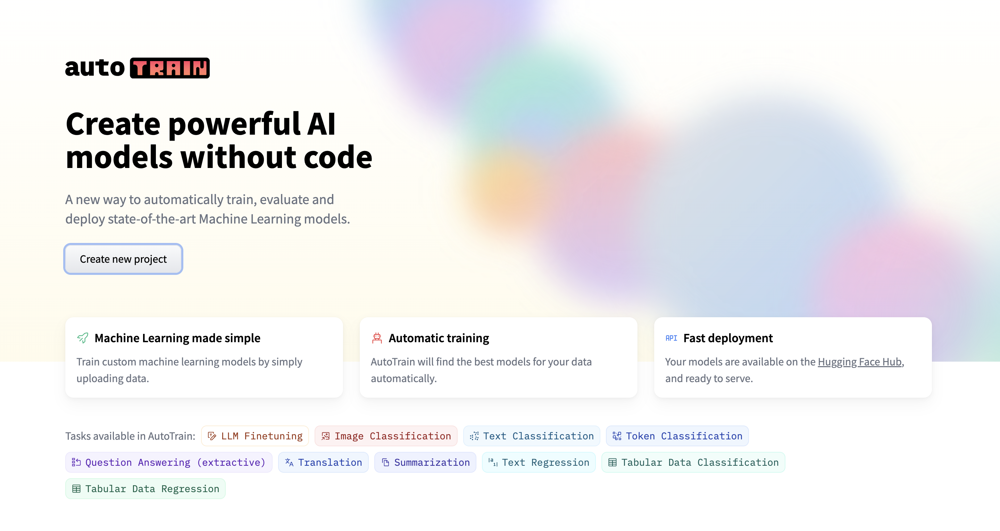
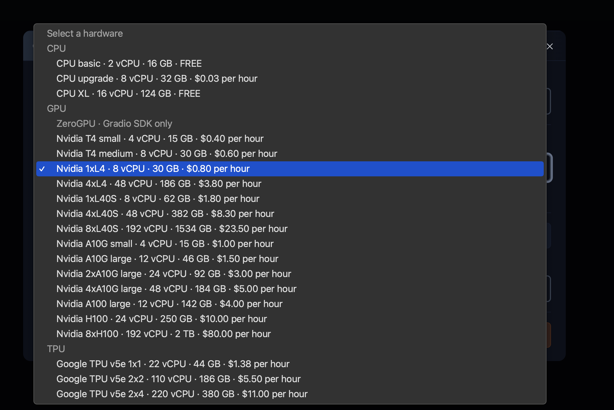
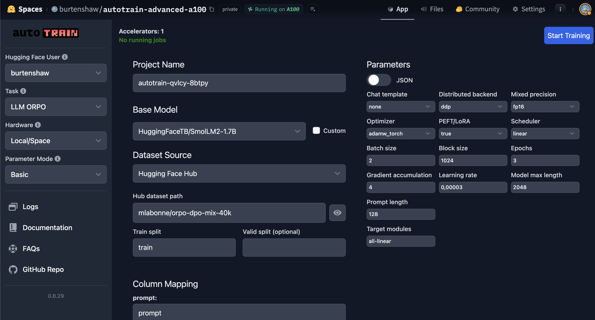

# Low Code Language Model Fine-tuning

In this tutorial we will fine-tune a language model without writing any complex code, and mainly using UI tools. We will use the `autotrain-advanced` library to fine-tune a small language model on a custom dataset. And we will use Argilla's UI to create and review the dataset. The tutorial will follow these core steps:

1. Create a dataset using Argilla's UI
2. Export the dataset to the hub
3. Train a language model using the AutoTrain UI
4. Evaluate the model using lighteval

## Create a Dataset

First we will create a dataset in Argilla based on an existing dataset. We will take a general approach to this, but in a real-world scenario you would want to create a dataset based on your specific use case. For example, you could filter the dataset to only include certain categories or topics.

### Start from an opensource dataset

We will work with Maxime Labonne's dataset of 40k samples with chosen and rejected completions. The dataset is available in the hub at `mlabonne/orpo-dpo-mix-40k`. Below is a preview of the dataset.



### Importing the dataset into Argilla

To import the dataset into Argilla, we will use the 'Create Dataset' feature in the UI. For a more detailed guide on how to create a dataset in Argilla, check out this [blog post](https://huggingface.co/blog/argilla-ui-hub).

The video below shows how to import the dataset into Argilla by pasting the dataset's repo id into the 'Create Dataset' form. In our case, the repo id is `mlabonne/orpo-dpo-mix-40k`.


The dataset configurator lets you define a feedback task in the UI based on the dataset that you're importing. In our case, we will use the default task, and add a question for relevance. This will allow us to filter the dataset based on categories or topics.

 

### Filter the dataset

After importing the dataset, we can filter it based on the relevance question we added. In our case, we will filter the dataset to only include completions that are relevant to the prompt. We will also filter the dataset to only include completions that are at least 10 tokens long.



## Export the dataset to the Hub

After filtering the dataset, we can export it to the hub. This will allow us to access the dataset in AutoTrain. Unfortunately, the export feature is not yet available in the UI, so we will have to use the python library to export the dataset.

```bash
huggingface_hub login
python create_dataset.py \
            --dataset_path argilla_dataset_name \
            --dataset_repo_id your_hf_repo_id
```

## Fine-tune

With a dataset on the hub, we can now fine-tune a language model using `autotrain-advanced`. We will use the `llm` command to fine-tune a language model on the dataset. 

### Install the required libraries

Before we can fine-tune the model, we need to install the required libraries. We will install `autotrain-advanced`, `datasets`, and `transformers`. We will also install the compatible versions of `torch`, `torchvision`, and `torchaudio`.

```python
# Uninstall existing torch, torchvision, and torchaudio
pip uninstall torch torchvision torchaudio -y

# Install compatible versions
pip install torch==2.0.1+cu118 torchvision==0.15.2+cu118 torchaudio==2.0.2 --extra-index-url https://download.pytorch.org/whl/cu118

# Install other required libraries
pip install -U autotrain-advanced
pip install -U datasets transformers
```

### Select the algorithm

There are countless fine-tuning algorithms for LLMs to chose from and many of the are supported by AutoTrain. We will work with the ORPO algorithm because it's simple to use and deliver significant improvements on base models. 

ORPO (Online Reward Policy Optimization) is a streamlined fine-tuning technique that merges two stages—supervised fine-tuning (SFT) and preference alignment—into one. This integration reduces both the computational load and training time. Traditionally, fine-tuning large language models (LLMs) for specific tasks involves SFT to adapt the model’s domain knowledge and then preference alignment (such as RLHF or Direct Preference Optimization) to prioritize preferred responses over undesirable ones. ORPO addresses an issue in the traditional method where SFT inadvertently increases the probability of both desirable and undesirable outputs, necessitating an additional alignment phase.

Developed by Hong and Lee in 2024, ORPO combines these processes by modifying the model’s objective function to include a loss term that rewards preferred responses while penalizing rejected ones. This approach has shown to outperform other alignment methods across different model sizes and tasks. ORPO’s efficiency and improved alignment make it a promising alternative in fine-tuning LLMs like Llama 3.

### Select the base model

The Hugging Face Hub contains thousands of language models that we could use as a base model for fine-tuning. We will use the SmolLM2 model as a base because it's only 1.7 billion parameters which means it will run on a wide range of hardware. It's also performed well on general benchmarks so we can expect reasonable performance from it on a number of use cases.


### Train the model

We can train the model in AutoTrain using the UI. The AutoTrain homepage lets you select the hardware you want to use for training, then it creates a space on Hugging Face.

 

You will need to select the hardware you want to use for training. The hardware you select will determine the number of GPUs you can use and the amount of VRAM you have access to. We reccoemnd starting with a Nvidia L40, which is available.

 

After a few minutes the AutoTrain UI will be ready for you to start training your model. You can start training by selecting the dataset you want to use, the model you want to finetune, and the training parameters you want to use. 

To begin, start off with the default parameters and adjust them as needed. Below is a list of the parameters you can adjust.

| Parameter              | Example             | Description                                  |
|------------------------|---------------------|----------------------------------------------|
| model                  | HuggingFaceTB/SmolLM2-135M | The base model to finetune from        |
| project-name           | my-autotrain-llm    | The name of your finetuned model             |
| data-path              | autotrain_data      | The dataset repo id                          |
| trainer                | orpo                | The training algorithm to use                |
| lr                     | 2e-5                | The learning rate                            |
| batch-size             | 4                   | The batch size for training and evaluation   |
| epochs                 | 1                   | The number of epochs to train                |
| block-size             | 512                 | The maximum input token length               |
| warmup-ratio           | 0.1                 | Ratio for learning rate warmup               |
| lora-r                 | 16                  | LoRA rank                                    |
| lora-alpha             | 32                  | LoRA alpha                                   |
| lora-dropout           | 0.05                | LoRA dropout rate                            |
| weight-decay           | 0.01                | Weight decay for regularization              |
| gradient-accumulation  | 4                   | Gradient accumulation steps                  |
| mixed-precision        | bf16                | Mixed precision format (e.g., bf16, fp16)    |
| max-prompt-length      | 256                 | Maximum length for prompts                   |
| max-completion-length  | 256                 | Maximum length for completions               |
| logging-steps          | 10                  | Steps interval for logging                   |
| save-total-limit       | 2                   | Limit for total number of saved checkpoints  |
| seed                   | 42                  | Random seed for reproducibility              |



- If you have limited hardware consider reducing the batch_size and block_size.
- If you have more VRAM than 40GB, you should increase your batch size.
- Once you've evaluated your model's checkpoints, you might wish to tweak epochs, weight-decay, and LoRa parameters.

## Evaluate the model

You can now evaluate your trained model. Here we will use some general benchmarks which can help to determine whether our model's performance has changed compared to its previous training. 

For a real-world use case, you would want to to evaluate your model on the task that you plan to use it for. In this guide on [custom evaluation](domain-eval/README.md) we show how to do that. 

```sh
lighteval accelerate \
    --model_args "pretrained=HuggingFaceTB/SmolLM2-135M" \
    --tasks "leaderboard|truthfulqa:mc|0|0" \
    --override_batch_size 1 \
    --output_dir="./evals/"
```